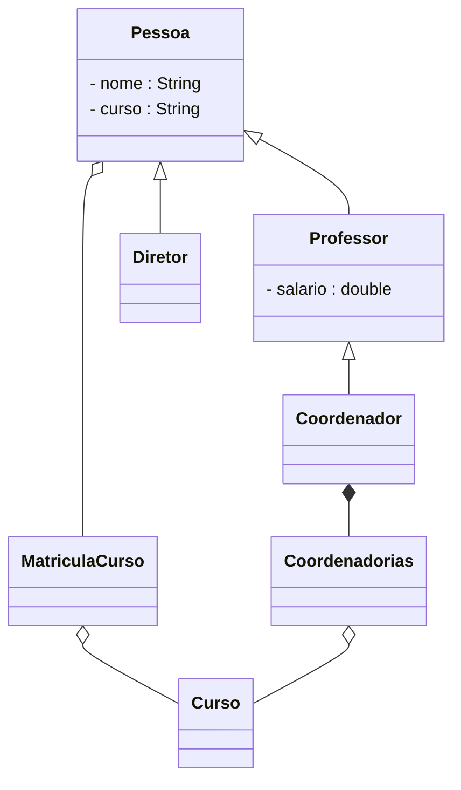
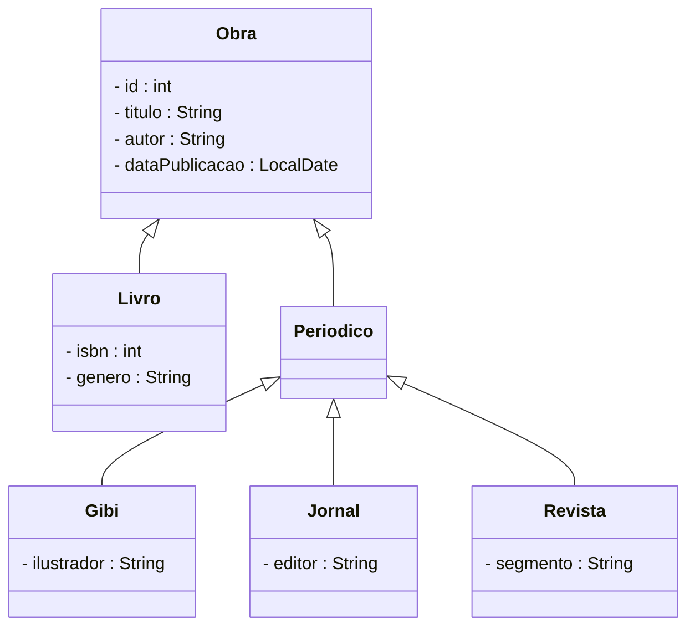
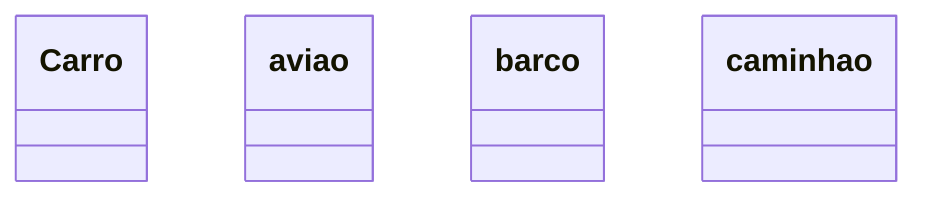

```mermaid
classDiagram

    class Pessoa {
        - nome : String
        - curso : String        
    }
       
    class Professor{
        - salario : double
    }
    
    class Coordenador{
        
    }
    
    class Diretor{
        
    }
    
    Pessoa <| -- Professor
    Pessoa <|-- Diretor
    Pessoa o-- MatriculaCurso
    MatriculaCurso o-- Curso
    Professor <|-- Coordenador
    Coordenador *-- Coordenadorias
    Coordenadorias o-- Curso
```

```mermaid
classDiagram
    
    class Obra{
        - id : int
        - titulo : String
        - autor : String
        - dataPublicacao : LocalDate
    }
    
    class Livro{
        - isbn : int
        - genero : String
    }
    
    class Revista{
        - segmento : String
    }
    
    class Jornal{
        - editor : String
    }
    
    class Gibi{
        - ilustrador : String
    }
    
    class Periodico {
        
    }
    
    Periodico <|-- Gibi
    Periodico <|-- Jornal
    Periodico <|-- Revista
        
    Obra <|-- Livro
    Obra <|-- Periodico
    
    
```

```mermaid
classDiagram
    class Carro {
        
    }
    
    class aviao{
        
    }
    
    class barco{
        
    }
    
    class caminhao{
        
    }
```